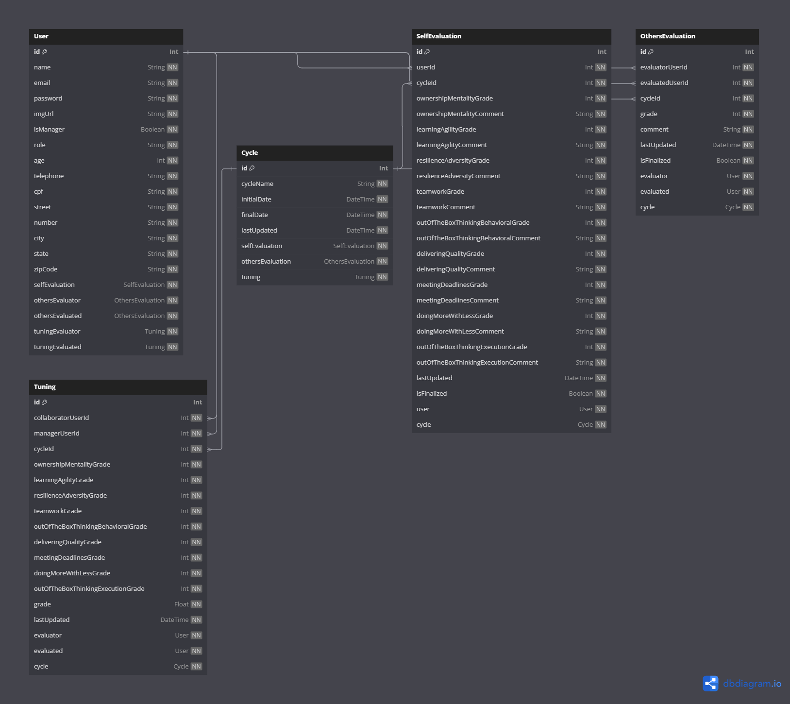

# Description

Monolith containing 5 modules that servers the TeamUp Application.

# How to run

  1. Clone repo and `npm i` 
  2. (Optional) Install and run Desktop Docker 
  3. If using Desktop Docker, Execute `docker-compose -f docker-compose.yml build --no-cache && docker-compose -f docker-compose.yml up -d`.
  4. If fail to execute on docker, execute `npm run start:dev` as an alternative.
  5. Open swagger in browser at [localhost:3000/api](http://localhost:3000/api)
  6. Try out each route

# Tests
```bash
# unit tests
$ npm run test

# test coverage
$ npm run test:cov
```

# SQL Database diagram

